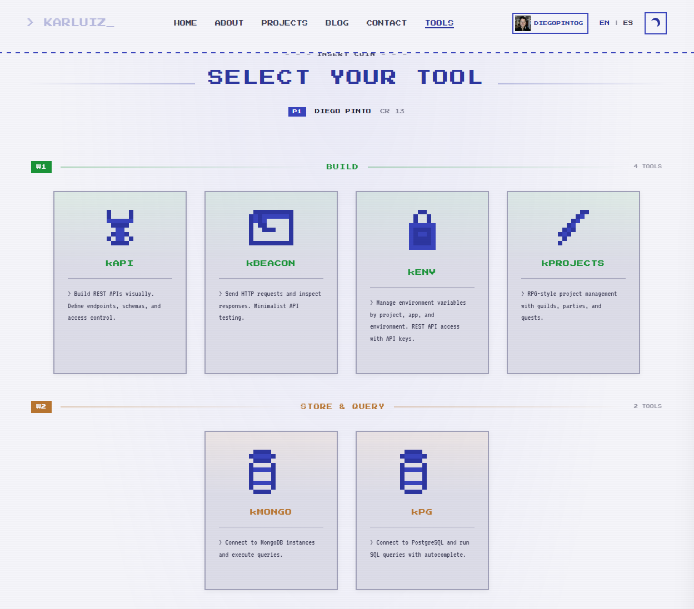

# karluiz-tool-cli

A fast, single-binary CLI written in Rust for consuming karluiz tools.

## Installation

### Download a pre-built binary (recommended)

Go to the [Releases page](../../releases) and download the archive for your platform:

| Platform | Archive |
|---|---|
| Linux x86_64 | `ktool-linux-x86_64.tar.gz` |
| Linux ARM64 | `ktool-linux-arm64.tar.gz` |
| macOS Intel | `ktool-macos-x86_64.tar.gz` |
| macOS Apple Silicon | `ktool-macos-arm64.tar.gz` |

```bash
# Example: Linux x86_64
curl -L https://github.com/CaDi-Team/karluiz-tool-cli/releases/latest/download/ktool-linux-x86_64.tar.gz \
  | tar -xz
sudo mv ktool /usr/local/bin/
```

### Build from source

Requires [Rust](https://rustup.rs) ≥ 1.85.

```bash
cargo install --locked --path .
```

The binary is installed as **`ktool`**.

## Usage

### 1 — Authenticate

```bash
ktool login
# Enter your KENV API token: ****
# ✓ Token saved to /home/you/.config/ktool/config.toml.
```

Your token is stored in `~/.config/ktool/config.toml` and reused automatically.

### 2 — Set default app & environment

```bash
ktool kenv --set-app=karluiz-calc --set-env=prod
# ✓ Config updated — app: karluiz-calc, env: prod.
```

You can update either flag independently:

```bash
ktool kenv --set-env=staging
ktool kenv --set-app=another-app
```

### 3 — List secrets

```bash
ktool kenv list
# DATABASE_URL=po***rl
# SECRET_KEY=sk***xy
# API_TOKEN=***
```

Secret values are **obfuscated by default** (first 2 + last 2 characters visible).

To see the raw JSON response:

```bash
ktool kenv list --json
```

### Show current context

```bash
ktool kenv
# Current context — app: karluiz-calc, env: prod
# Run `ktool kenv list` to fetch secrets.
```

## Config file

```
~/.config/ktool/config.toml
```

```toml
token = "your-api-token"
app   = "karluiz-calc"
env   = "prod"
```

## Using `ktool` in GitHub Actions pipelines

You can pull the binary directly from a workflow run artifact (no release tag needed) or from a published release.

### Option A — download from a release tag

```yaml
- name: Install ktool
  run: |
    curl -L https://github.com/CaDi-Team/karluiz-tool-cli/releases/latest/download/ktool-linux-x86_64.tar.gz \
      | tar -xz
    sudo mv ktool /usr/local/bin/

- name: Fetch secrets
  env:
    KENV_API_KEY: ${{ secrets.KENV_API_KEY }}
  run: |
    echo "$KENV_API_KEY" | ktool login   # non-interactive: pipe token via stdin
    ktool kenv --set-app=my-app --set-env=prod
    ktool kenv list --json > secrets.json
```

### Option B — download the artifact from this repo's workflow run

```yaml
- name: Download ktool artifact
  uses: dawidd6/action-download-artifact@v6
  with:
    github_token: ${{ secrets.GITHUB_TOKEN }}
    repo: CaDi-Team/karluiz-tool-cli
    workflow: release.yml
    name: ktool-linux-x86_64.tar.gz
    path: /tmp/ktool

- name: Install ktool
  run: tar -xz -C /usr/local/bin -f /tmp/ktool/ktool-linux-x86_64.tar.gz
```

## Releases & CI

A new release is created automatically when a tag of the form `v*` is pushed:

```bash
git tag v1.0.0
git push origin v1.0.0
```

The release workflow cross-compiles for all four platforms, attaches the archives to the GitHub Release, and retains them as workflow artifacts for 90 days.

## Credits — Karluiz

A huge shout-out and all credit where it truly belongs: to my good friend **[Karluiz](https://karluiz.com/)**.

This CLI exists only because Karluiz built the actual tools and services behind it. `ktool` is just a thin Rust wrapper to consume his work from the terminal — the real engineering, the ideas, and the hard work are **100% his**. I refuse to take credit for what he created, and I want anyone reading this to know exactly who made it possible.

Karluiz is a developer who has been coding since age 7 on a Commodore 64 — over 30 years of passion poured into every project. His site is a love letter to that journey: retro pixel aesthetics, 8-bit RPG mini-games, and a growing collection of free developer tools that he builds and shares with the community. From CRM systems to hotel management platforms to his suite of ktools, everything he ships is built with genuine passion and generosity.

**His tools are free.** Go check them out, explore his projects, read his blog, and see what a developer driven by pure love for the craft looks like:

**[karluiz.com](https://karluiz.com/)**

<p align="center">
  <a href="https://karluiz.com/">
    
  </a>
</p>

> *"Every line of code is written with the same passion I felt at age 7."* — Karluiz

Thank you, Karluiz. This project wouldn't exist without your work. Readers: do yourself a favor and visit his page — you won't regret it.

---

## Development

```bash
cargo build          # debug build
cargo test           # unit tests
cargo clippy         # lint
cargo build --release  # optimised binary → target/release/ktool
```
